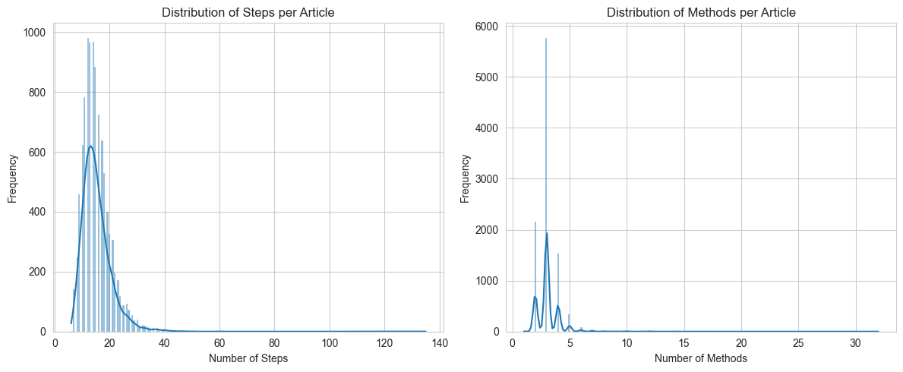
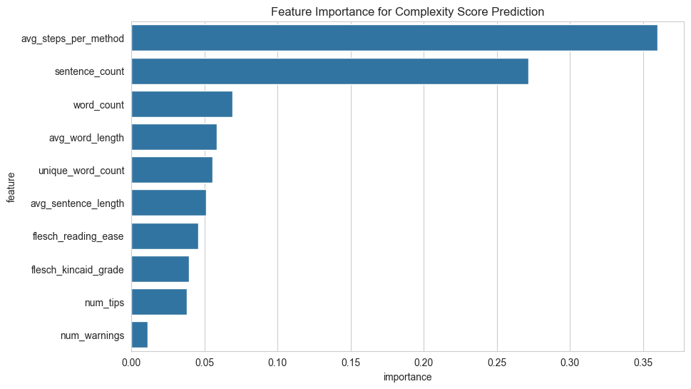
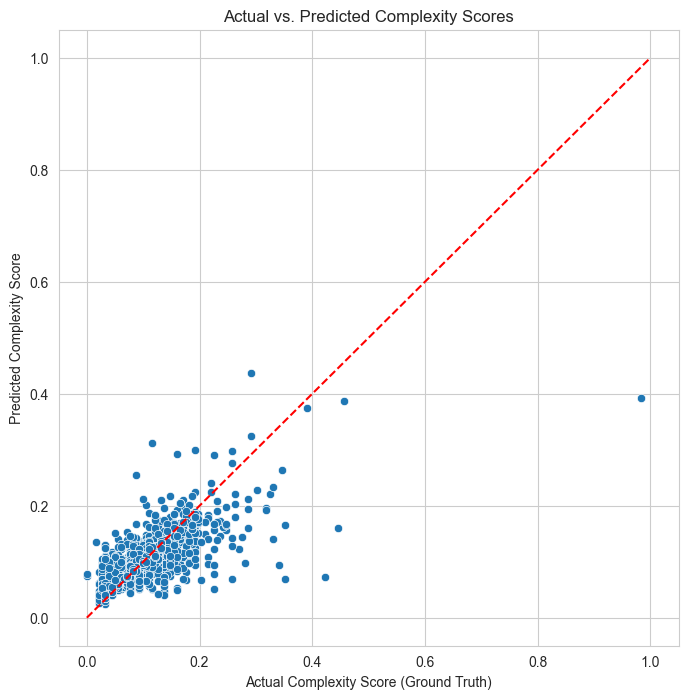

# Instruction Complexity Analyzer

An AI-powered tool that analyzes instructional text and predicts a "complexity score" to aid users with executive function challenges.

---

## Table of Contents

* [About The Project](#about-the-project)
* [Key Features](#key-features)
* [Technologies Used](#technologies-used)
* [Getting Started](#getting-started)
  * [Prerequisites](#prerequisites)
  * [Installation & Setup](#installation--setup)
* [The Machine Learning Pipeline](#the-machine-learning-pipeline)
* [Results](#results)
* [Contributing](#contributing)
* [Data Source & Acknowledgments](#data-source--acknowledgments)

---

## About The Project

For individuals with executive function challenges like ADHD or cognitive fog, initiating a task from a complex set of instructions can be a significant barrier. This project, the **Instruction Complexity Analyzer**, serves as a "cognitive ramp" to address this accessibility issue.

The tool analyzes any given instructional text and predicts a "complexity score." This allows a user to gauge the mental energy required for a task *before* they begin, helping them to better manage their time, set expectations, and approach new tasks with more confidence.

---

## Key Features

* **Predicts Complexity:** Provides a numerical score for any given instructional text.
* **Rich Feature Set:** Utilizes 7 linguistic and structural metrics for its predictions.
* **Optimized Model:** Built on a tuned Gradient Boosting Regressor, selected after comparing multiple algorithms.
* **Interactive Demo:** Includes a user-friendly web application built with Streamlit for live analysis.

---

## Technologies Used

* **Python:** Primary programming language
* **Pandas & NumPy:** Data manipulation and analysis
* **Scikit-learn:** For training and evaluating regression models
* **Textstat:** For calculating readability scores
* **Matplotlib & Seaborn:** For data visualization

---

## Getting Started

To get a local copy up and running, follow these steps.

### Prerequisites

You will need Python 3.8+ and pip installed on your system.

### Installation & Setup

1.  **Clone the repository:**
    ```bash
    git clone [https://github.com/your-username/your-repo-name.git](https://github.com/your-username/your-repo-name.git)
    cd your-repo-name
    ```

2.  **Download the Dataset:**
    * The wikiHow dataset (`wikihow.pickle`) is too large to be included in this repository.
    * Please download it from the source on Kaggle: [wikiHow All Dataset](https://www.kaggle.com/datasets/aniketsharma00411/wikihow-raw-data/data).
    * Place the downloaded `wikihow.pickle` file into the root directory of this project.

3.  **Install dependencies:**
    ```bash
    pip install -r requirements.txt
    ```

4.  **Run the Jupyter Notebook (Optional):**
    * To see the full data analysis, feature engineering, and model training process, you can now run the Jupyter Notebook included in this repository.

5.  **Run the Streamlit Demo:**
    * To use the final, trained model, run the following command in your terminal:
    ```bash
    streamlit run app.py
    ```

---

## The Machine Learning Pipeline

Our project followed a standard, rigorous machine learning workflow:

1.  **Data Sourcing & Preparation:** We used a dataset of wikiHow articles and created a working subset of 10,000 articles.
2.  **Feature Engineering:** We converted the raw text of each article into a rich numerical feature set of 10 linguistic and structural metrics.
3.  **Model Training & Tuning:** We trained and compared multiple regression models (Linear, Lasso, Ridge, Random Forest, Gradient Boosting). We then performed hyperparameter tuning on the top performers to find the optimal settings.
4.  **Evaluation:** We selected our final model based on its performance on a held-out test set, using Root Mean Squared Error (RMSE) as our primary metric.

---

## Results

After comparing multiple models and performing hyperparameter tuning on an expanded dataset of 10,000 samples, our final **Tuned Gradient Boosting Regressor** was the clear winner. It achieved a **Root Mean Squared Error (RMSE) of 0.0354** on the test set, indicating a very high degree of accuracy.

### Data Visualizations

**1. Exploratory Data Analysis**
*These histograms show the distribution of steps and methods in our 10,000-article dataset. We observed that most articles are moderately complex, with a long tail of more complex instructions, which is ideal for training.*


**2. Feature Importance**
*This plot reveals our final model's strategy. It learned that the instruction's structure (average steps per method) and its overall volume (sentence and word counts) are the most powerful predictors of complexity.*


**3. Model Performance: Actual vs. Predicted**
*This scatter plot visualizes our model's high accuracy. The tight clustering of predictions around the red "perfect prediction" line confirms the model's reliability.*


---

## Contributing

Contributions are what make the open-source community such an amazing place to learn, inspire, and create. Any contributions you make are **greatly appreciated**.

1.  Fork the Project
2.  Create your Feature Branch (`git checkout -b feature/AmazingFeature`)
3.  Commit your Changes (`git commit -m 'Add some AmazingFeature'`)
4.  Push to the Branch (`git push origin feature/AmazingFeature`)
5.  Open a Pull Request

---

## Data Source & Acknowledgments

* **Primary Dataset:** The [wikiHow All Dataset](https://www.kaggle.com/datasets/aniketsharma00411/wikihow-raw-data/data) from Kaggle was used as the source for all instructional articles.
* This project was developed as part of the **AI4ALL Ignite Program**.
